# JOBLEX-OpportunityFlow: Master Architecture & Synchronization Plan
**Smart India Hackathon 2026 | Problem Statement ID: 26044**  
**Team: FOXTROT (Team ID: 168485)**  
**Version:** 1.0.0 (Production Blueprint)

---

## 1. Executive Vision & Problem Statement Alignment

Under SIH 2026 Problem Statement 26044 (*"Portal for Academia Industry collaboration for Skill Mapping, Internships and Placement"*), **JOBLEX-OpportunityFlow** connects the three essential stakeholders of higher education and employment:
1. **Students**: Needing guided navigation, skill validation, transparent gap analysis, and placement opportunities.
2. **Academic Institutions / Colleges**: Needing automated curriculum modernization, industry demand signals, accreditation data (NAAC/NBA/NEP-2020), and research MoUs.
3. **Industry Partners / Corporate HR**: Needing verified skill profiles, candidate evaluation tools, syllabus influence, and direct campus pipelines.

```mermaid
flowchart TD
    subgraph StudentPortal["Student Gateway"]
        SP_Profile["Student Profile & Verified Skills"]
        SP_DecTree["Decision Tree & Skill Gap Engine"]
        SP_Roadmap["Personalized Career Roadmap"]
        SP_Constellation["Skill Constellation 2D/3D Graph"]
        SP_Zulu["Zulu AI Companion"]
        SP_Quiz["Quiz Arena & Anti-Decay XP"]
        SP_Exams["Assigned Hiring Tests"]
        SP_Mentorship["1-on-1 Guidance Requests"]
        SP_Analytics["Real-time Market Vacancy Analytics"]
    end

    subgraph CoreHub["JOBLEX Unified Hub & Synchronization Engine"]
        API_Auth["Role-Based Authentication (RBAC)"]
        API_Matching["Hybrid Cosine-Jaccard Matching Engine"]
        API_Ontology["88-Skill Canonical Ontology Repository"]
        API_Storage["Decoupled Storage & Audit Ledgers"]
        API_EventBus["Cross-Portal Event & Notification Dispatcher"]
    end

    subgraph IndustryPortal["Industry / Corporate Gateway"]
        IP_Post["Corporate Requisitions & Opportunities"]
        IP_Exams["Hiring Exam Creator & Candidate Testing"]
        IP_Dossiers["Candidate Dossiers & Scoring Review"]
        IP_Syllabus["University Syllabus Review Engine"]
        IP_MoU["Bilateral MoU Initiation & Tracking"]
        IP_Calibrator["AI Weight Calibrator"]
    end

    subgraph AcademyPortal["Academy / College Gateway"]
        AP_Curriculum["Curriculum Modernization & BoS"]
        AP_Audit["AI Accreditation & NEP-2020 Audits"]
        AP_MoU["Inbound MoU Negotiation & Ratification"]
        AP_Benchmarking["Cross-College Performance Benchmarking"]
        AP_Mentors["Faculty Mentorship Hub"]
    end

    %% Sync connections
    SP_Profile --> API_Matching
    IP_Post --> API_Matching
    API_Matching --> SP_Analytics

    IP_Exams <-->|Test Assignment & Submissions| SP_Exams
    SP_Mentorship <-->|Mentorship Slots & Inquiries| AP_Mentors
    SP_Mentorship <-->|Industry Mentorship Slots| IP_Dossiers

    IP_Syllabus -->|Skill Demand Signals| AP_Curriculum
    IP_MoU <-->|Drafts, Negotiations & Sign-offs| AP_MoU
    
    API_Ontology --> SP_Constellation
    API_Ontology --> SP_DecTree
    SP_DecTree --> SP_Roadmap
```



---

## 2. Cross-Portal Data Synchronization Contracts

To ensure total synchronization across all three portals, the following canonical contracts govern data exchange:

### Contract 1: Hiring Exam Lifecycle (Industry $\leftrightarrow$ Student)
```
[Company Creates Requisition]
       │
       ▼
[Company Builds / Selects Hiring Exam]
       │
       ▼
[Company Assigns Exam to Candidate Dossier]
       │
       ├──► Dispatches Notification & Action Docket item to Student
       │
       ▼
[Student Takes Exam in Quiz Arena]
       │ (15m TTL, Decoupled Answer Verification, Anti-Replay)
       ▼
[Score Computed & Verified]
       │
       ├──► Awards XP / Badges to Student Profile
       └──► Updates Candidate Status & Score on Industry Dossier Review
```

### Contract 2: University Syllabus Review & Bilateral MoU (Industry $\leftrightarrow$ Academy)
```
[Academy Publishes Department Syllabus]
       │
       ▼
[Industry Reviews Syllabus by Department]
       │
       ├──► Submits Technical Feedback & Skill Gap Demand Signal
       │         └──► Delivered to Academy Board of Studies (BoS)
       ▼
[Company Initiates Bilateral MoU]
       │ (Selects Partnership Scope: Labs / Internships / Curriculum / Grants)
       ▼
[Academy Dean Receives Inbound Proposal]
       │
       ├──► Draft ──► Negotiation ──► Ratified / Signed
       └──► Logged in National Academic Alliance Ledger
```

### Contract 3: 1-on-1 Guidance & Mentorship (Student $\leftrightarrow$ Academy & Industry)
```
[Verified Mentors Directory Populated]
  (Deans/Professors from Academy + Talent Leads from Industry)
       │
       ▼
[Student Selects Mentor & Focus Area]
  (Research / Placement / Technical Deep-Dive / Capstone Review)
       │
       ▼
[Request Dispatched with Agenda]
       │
       ├──► Mentor Accepts & Assigns Virtual Slot
       └──► Session Added to Student Contextual To-Do Docket
```

---

## 3. Database Entities & Persistence Strategy

All persistent entities exist in PostgreSQL via Supabase, with automatic synchronization to local active data structures for offline resilience.

| Entity Table | Primary Key | Foreign References | Purpose |
| :--- | :--- | :--- | :--- |
| `hiring_exams` | `id` (UUID) | `company_id`, `opportunity_id` | Stores hiring assessments created by employers. |
| `hiring_exam_questions`| `id` (UUID) | `exam_id` | Individual test questions, options, difficulty, and skill mapping. |
| `candidate_exam_assignments` | `id` (UUID) | `exam_id`, `candidate_id`, `student_email` | Links students to tests with attempt status (`pending`, `completed`, `expired`). |
| `candidate_exam_results` | `id` (UUID) | `assignment_id`, `student_id` | Detailed scores, skill-wise breakdown, and tamper-proof submission hash. |
| `syllabus_catalog` | `id` (UUID) | `institution_id`, `department` | Formal university department syllabi. |
| `syllabus_reviews` | `id` (UUID) | `syllabus_id`, `company_id` | Structured corporate feedback, relevance ratings, and modern tech recommendations. |
| `mou_initiatives` | `id` (UUID) | `company_id`, `institution_id` | Full lifecycle of bilateral MoUs (`draft`, `in_review`, `ratified`). |
| `mentorship_requests`| `id` (UUID) | `student_id`, `mentor_id` | 1-on-1 guidance booking requests, agendas, meeting links, and statuses. |
| `decision_tree_profiles` | `id` (UUID) | `student_id` | Student decision tree responses, evaluated competencies, and target role resolution. |

---

## 4. Implementation Phasing & Workstreams

| Phase | Core Objective | Modules Touched | Estimated Files |
| :--- | :--- | :--- | :--- |
| **Phase 1** | **Data Resilience & Route Fixes** | `opportunities.routes.js`, test suites | 2 backend files |
| **Phase 2** | **PPT Uniqueness Features** | Company Hiring Exams, Syllabus Review & MoUs | 4 backend, 4 frontend |
| **Phase 3** | **PPT Innovation Features** | 1-on-1 Mentorship, Real-time Graphical Analytics | 3 backend, 3 frontend |
| **Phase 4** | **Process Flow & Visual Map** | Decision Tree Engine, Dynamic Skill Constellation | 3 backend, 3 frontend |
| **Phase 5** | **Comprehensive E2E Verification** | Automated test scripts, cross-portal verification | 3 test suites |

---

## 5. Verification Gate & Sign-Off Criteria

1. **Zero Route Regressions**: Every existing route (`/api/auth`, `/api/roadmap`, `/api/opportunities`, `/api/assessment`, `/api/zulu`, `/api/industry`, `/api/academy`) must return HTTP 200/201 without unhandled 500 exceptions.
2. **Automated E2E Suite Execution**:
   - `verify_cross_portal_connectivity.js` must pass 100%.
   - `verify_resume_and_matching.js` must pass 100%.
   - `verify_hiring_exams.js` must pass 100%.
   - `verify_mou_and_guidance.js` must pass 100%.
3. **Cross-Portal Consistency**: Actions taken in one portal must immediately reflect in connected portals (e.g. Exam assigned in Industry appears in Student Quiz; Syllabus feedback submitted in Industry appears in Academy BoS).
