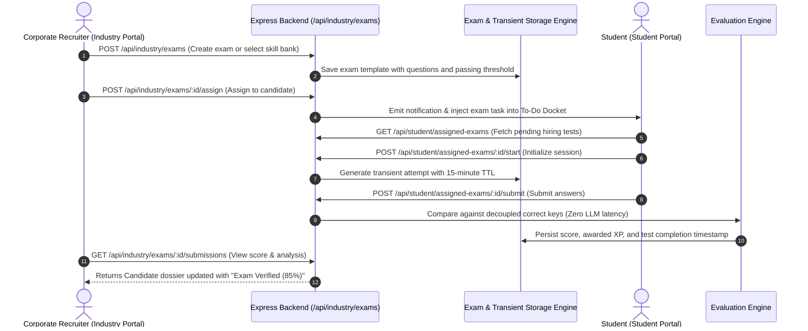

# Module Implementation Plan: Company Hiring Exam Conduction Engine
**PPT Uniqueness Feature #1:** *"Company can conduct exam/test for the students to test their skills in hiring process."*  
**Target Directory:** `a:\ProgrammingCodes\Projects\SIH 26\mainsihrepo`  
**Status:** Implementation Blueprint

---

## 1. Problem & Feature Scope

Currently, corporate recruiters can only browse candidate dossiers and post requisitions. When reviewing candidates or applications, employers need the ability to conduct rigorous, competency-based screening tests directly within the hiring funnel.

This module delivers:
1. **Corporate Exam Builder**: HR/Recruiters can create or auto-generate skill screening tests linked to open requisitions or custom roles.
2. **Direct Candidate Assignment**: Recruiters can assign the exam to applicants or inbound candidate dossiers with custom deadlines and passing criteria.
3. **Student Test-Taking in Quiz Arena**: Students receive in-portal notifications and take the timed test via the existing anti-replay, decoupled verification engine (`quizStorage.service`).
4. **Recruiter Evaluation Dashboard**: Automated scoring, percentile calculation, question-by-question breakdown, and candidate dossier stamping.

---

## 2. Technical Architecture & Component Flow



---

## 3. Database Schema & Data Models

### 1. `hiring_exams`
```sql
CREATE TABLE IF NOT EXISTS hiring_exams (
  id UUID PRIMARY KEY DEFAULT gen_random_uuid(),
  company_id VARCHAR(100) NOT NULL,
  company_name VARCHAR(255) NOT NULL,
  title VARCHAR(255) NOT NULL,
  role_title VARCHAR(255) NOT NULL,
  department VARCHAR(100) DEFAULT 'General',
  duration_minutes INT DEFAULT 20,
  passing_percentage INT DEFAULT 70,
  total_questions INT NOT NULL,
  skills TEXT[] DEFAULT '{}',
  created_at TIMESTAMP WITH TIME ZONE DEFAULT NOW()
);
```

### 2. `hiring_exam_questions`
```sql
CREATE TABLE IF NOT EXISTS hiring_exam_questions (
  id UUID PRIMARY KEY DEFAULT gen_random_uuid(),
  exam_id UUID REFERENCES hiring_exams(id) ON DELETE CASCADE,
  question_text TEXT NOT NULL,
  options JSONB NOT NULL, -- Array of 4 string options
  correct_index INT NOT NULL,
  skill_category VARCHAR(100),
  difficulty VARCHAR(20) DEFAULT 'medium',
  explanation TEXT
);
```

### 3. `candidate_exam_assignments`
```sql
CREATE TABLE IF NOT EXISTS candidate_exam_assignments (
  id UUID PRIMARY KEY DEFAULT gen_random_uuid(),
  exam_id UUID REFERENCES hiring_exams(id) ON DELETE CASCADE,
  candidate_email VARCHAR(255) NOT NULL,
  candidate_name VARCHAR(255) NOT NULL,
  opportunity_id VARCHAR(100),
  status VARCHAR(50) DEFAULT 'Pending', -- 'Pending', 'In Progress', 'Completed', 'Expired'
  score INT DEFAULT NULL,
  passed BOOLEAN DEFAULT NULL,
  assigned_at TIMESTAMP WITH TIME ZONE DEFAULT NOW(),
  completed_at TIMESTAMP WITH TIME ZONE DEFAULT NULL
);
```

---

## 4. API Endpoints Specification

### Industry Portal Endpoints (`backend/routes/industry.routes.js`)
- `GET /api/industry/exams`: List all hiring exams created by the authenticated company.
- `POST /api/industry/exams`: Create a new hiring exam. Supports either manual question input or auto-generating questions from `SKILL_ONTOLOGY`.
- `POST /api/industry/exams/:id/assign`: Assign a specific exam to a student email/candidate ID.
- `GET /api/industry/exams/:id/submissions`: Retrieve all candidate results for a given exam.

### Student Portal Endpoints (`backend/routes/assessment.routes.js` or `backend/routes/student.routes.js`)
- `GET /api/student/assigned-exams`: Retrieve active and pending corporate tests assigned to the current student.
- `POST /api/student/assigned-exams/:id/start`: Begin the test session; stores transient attempt token in `quizStorage.service`.
- `POST /api/student/assigned-exams/:id/submit`: Validate candidate submission against stored correct keys, compute percentage, update candidate assignment record, and grant XP.

---

## 5. Frontend UI Modifications

### A. Industry Portal
1. **Candidate Dossiers Page (`src/industry/industry-candidates.html`)**:
   - Add **"Conduct Hiring Exam"** action button on candidate cards.
   - Replace empty `handleRequestAssessment` function with an interactive modal allowing HR to:
     - Select an existing exam or quickly generate one.
     - Set time limit and pass mark.
     - Click **"Send Exam Invitation"**.
   - Show an **"Exam Status"** badge (`Not Tested`, `Exam Pending`, `Scored 88% - Passed`).

2. **Corporate Requisitions Page (`src/industry/industry-requisitions.html`)**:
   - Allow attaching a screening exam to new job/internship postings so applicants are automatically queued for the test upon application.

### B. Student Portal
1. **Student Dashboard (`student.html`)**:
   - Add a high-visibility alert banner when an enterprise exam is pending.
   - Insert an item into the Contextual To-Do Engine: *"Complete Hiring Assessment from Dabur India Ltd."*.

2. **Quiz Arena (`src/students/student-quiz.html`)**:
   - Add a dedicated tab: **"Enterprise Screening Exams"**.
   - Full-screen distraction-free test interface with countdown timer, progress bar, and instant completion summary certificate.

---

## 6. Testing & Validation Checklist

- [ ] Create an exam via `POST /api/industry/exams` with 5 technical questions.
- [ ] Assign the exam to student `aarav.sharma@aiia.gov.in`.
- [ ] Verify student sees assigned exam in `GET /api/student/assigned-exams`.
- [ ] Start and submit the exam with 4/5 correct answers.
- [ ] Verify candidate assignment updates to `Completed` with `score: 80%` and `passed: true`.
- [ ] Verify the recruiter dossier view reflects `80% - Passed` on the candidate card.
