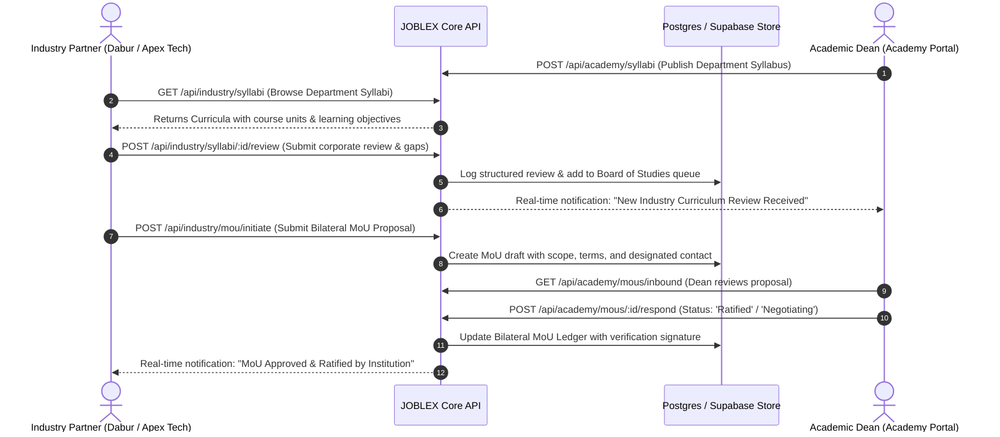

# Module Implementation Plan: University Syllabus Review & Bilateral MoU Engine
**PPT Uniqueness Feature #2:** *"Multiple company can review university syllabus and initiate talk for MoU."*  
**Target Directory:** `a:\ProgrammingCodes\Projects\SIH 26\mainsihrepo`  
**Status:** Implementation Blueprint

---

## 1. Problem & Feature Scope

Academia often operates with syllabi that lag behind fast-evolving industry requirements. At the same time, companies struggle to build formal partnerships (MoUs) without clear visibility into institutional curricula.

This module delivers:
1. **University Syllabus Catalog & Explorer**: Employers can browse accredited syllabi across departments (Ayush Informatics, Phytopharmacology, Software Engineering, AI & Data Systems).
2. **Multi-Company Syllabus Review & Signal Emission**: Multiple companies can independently audit course modules, rate modern relevance, and transmit actionable skill demand signals to the Academic Board of Studies (BoS).
3. **Bilateral MoU Initiation Workflow**: Companies can initiate formal MoU proposals directly from a syllabus review or institution page, specifying collaboration tracks (Internship Pipelines, Joint Labs, Curriculum Co-Design, Sponsored Research).
4. **Academy Dean Inbound Ledger**: Academic deans view incoming company reviews, respond to MoU proposals, update partnership stages (*Draft $\to$ In Review $\to$ Ratified*), and generate accreditation-ready evidence for NAAC/NEP-2020.

---

## 2. Technical Architecture & Component Flow



---

## 3. Database Schema & Data Models

### 1. `curriculums` (University Department Syllabus)
```sql
CREATE TABLE IF NOT EXISTS curriculums (
  id VARCHAR(100) PRIMARY KEY,
  institution VARCHAR(255) NOT NULL,
  department VARCHAR(255) NOT NULL,
  degree VARCHAR(100) NOT NULL,
  academic_year VARCHAR(50) NOT NULL,
  units JSONB NOT NULL, -- Array of units: [{ title: string, topics: string[], credits: int }]
  status VARCHAR(50) DEFAULT 'Published',
  created_at TIMESTAMP WITH TIME ZONE DEFAULT NOW()
);
```

### 2. `syllabus_reviews` (Corporate Feedback on Curriculum)
```sql
CREATE TABLE IF NOT EXISTS syllabus_reviews (
  id UUID PRIMARY KEY DEFAULT gen_random_uuid(),
  curriculum_id VARCHAR(100) NOT NULL,
  company_name VARCHAR(255) NOT NULL,
  reviewer_name VARCHAR(255) NOT NULL,
  relevance_rating NUMERIC(2,1) NOT NULL, -- 1.0 to 5.0
  strengths TEXT[] DEFAULT '{}',
  identified_gaps TEXT[] DEFAULT '{}',
  recommended_technologies TEXT[] DEFAULT '{}',
  feedback_notes TEXT NOT NULL,
  created_at TIMESTAMP WITH TIME ZONE DEFAULT NOW()
);
```

### 3. `mou_partnerships` (Bilateral Agreements)
```sql
CREATE TABLE IF NOT EXISTS mou_partnerships (
  id VARCHAR(100) PRIMARY KEY,
  company VARCHAR(255) NOT NULL,
  institution VARCHAR(255) NOT NULL,
  department VARCHAR(255) NOT NULL,
  scope_tracks TEXT[] NOT NULL, -- ['Student Internships', 'Curriculum Co-Design', 'Joint R&D Lab', 'Sponsored Capstone']
  tenure_years INT DEFAULT 3,
  status VARCHAR(50) DEFAULT 'Draft', -- 'Draft', 'Under BoS Review', 'Negotiating', 'Ratified'
  effective_date DATE,
  signatory_industry VARCHAR(255),
  signatory_academy VARCHAR(255),
  deliverables TEXT[] DEFAULT '{}',
  created_at TIMESTAMP WITH TIME ZONE DEFAULT NOW()
);
```

---

## 4. API Endpoints Specification

### Industry Routes (`backend/routes/industry.routes.js`)
- `GET /api/industry/syllabi`: Retrieve all accredited university department syllabi available for review.
- `GET /api/industry/syllabi/:id`: View detailed units, learning outcomes, and past industry review scores for a specific syllabus.
- `POST /api/industry/syllabi/:id/review`: Submit formal corporate evaluation, relevance rating, and modern skill recommendations.
- `POST /api/industry/mou/initiate`: Initiate a bilateral MoU agreement with an academic institution.
- `GET /api/industry/mous`: View company's active bilateral MoUs and partnership statuses.

### Academy Routes (`backend/routes/academy.routes.js`)
- `GET /api/academy/syllabus-reviews`: View all corporate reviews submitted by companies for the institution's syllabi.
- `GET /api/academy/mous/inbound`: Retrieve incoming and active bilateral MoU proposals.
- `POST /api/academy/mous/:id/respond`: Academic dean accepts, requests modifications, or ratifies an MoU.

---

## 5. Frontend UI Modifications

### A. Industry Portal
1. **Bilateral MoUs Page (`src/industry/industry-mous.html`)**:
   - Add a high-profile tab: **"Review University Syllabi"**.
   - Syllabus card listing with filters for Department and Institution.
   - Interactive **"Review Syllabus"** modal with star ratings, gap checkboxes, and suggestion inputs.
   - Add an **"Initiate MoU Partnership"** primary action button opening a streamlined 3-step MoU builder wizard.

### B. Academy Portal
1. **Curriculum Modernization Page (`src/academy/academy-curriculum.html`)**:
   - Add **"Industry Feedback Signals"** section displaying real-time reviews from corporate partners.
   - Show BoS adoption status (*"Incorporated into 2026-27 Electives"*).

2. **Bilateral MoUs Page (`src/academy/academy-mous.html`)**:
   - Add **"Inbound Corporate Proposals"** inbox with **"Review & Ratify"** action.
   - Dynamic badge updating live from `Draft` $\to$ `Ratified`.

---

## 6. Testing & Validation Checklist

- [ ] Query `GET /api/industry/syllabi` and receive list of department syllabi.
- [ ] Submit review via `POST /api/industry/syllabi/:id/review` with rating 4.2 and modern recommendations.
- [ ] Verify that review appears in Academy Dean's feedback stream.
- [ ] Submit MoU proposal via `POST /api/industry/mou/initiate` for *All India Institute of Ayurveda*.
- [ ] Academic Dean accepts and updates status to `Ratified` via `POST /api/academy/mous/:id/respond`.
- [ ] Verify both Industry and Academy MoU listings display the newly ratified agreement.
