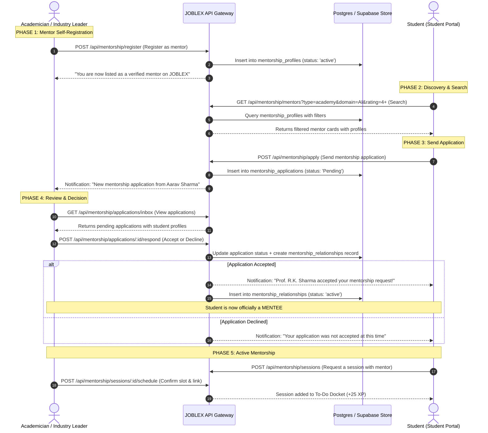

# Module Implementation Plan: 1-on-1 Mentorship & Guidance System
**PPT Innovation Feature #2:** *"Students easily send a request for 1-on-1 guidance, connecting learners with verified academic professors or industry leaders."*  
**Target Directory:** `a:\ProgrammingCodes\Projects\SIH 26\mainsihrepo`  
**Status:** Implementation Blueprint

---

## 1. Problem & Feature Scope

Students in Tier-2/3 institutions lack direct access to senior academic researchers and corporate industry leaders for personalized career guidance. The platform bridges this gap through a structured **Mentor Discovery → Application → Acceptance → Mentorship** lifecycle.

### Core User Flow

```
Student Logs In ──► Navigates to Mentors Module ──► Searches & Filters Mentors
       │                                                       │
       │              ┌────────────────────────────────────────┘
       │              ▼
       │     Student Sends Mentorship Application Request
       │              │
       │              ▼
       │     Mentor Reviews Incoming Application
       │              │
       │         ┌────┴────┐
       │         ▼         ▼
       │     ACCEPT     DECLINE
       │         │
       │         ▼
       │     Student becomes MENTEE
       │     (Ongoing mentorship relationship established)
       │         │
       │         ▼
       │     Mentor & Mentee communicate, schedule sessions, track progress
```

### Who Can Be a Mentor?

Mentors are **academicians** or **industry leaders** who have **registered themselves as mentors** on the platform. They are NOT automatically listed — they must explicitly opt-in by creating a mentor profile from their Academy or Industry portal.

### What This Module Delivers

1. **Mentor Self-Registration**: Academicians (via Academy Portal) and industry leaders (via Industry Portal) can register themselves as mentors by specifying their expertise domains, availability, bio, and mentorship capacity.
2. **Mentor Discovery & Multi-Parameter Search**: Students browse and search the mentor directory using multiple filters:
   - **Mentor Type**: Academician vs. Industry Leader
   - **Domain / Expertise**: e.g. *Phytochemistry*, *Full-Stack Engineering*, *Data Science*, *GLP Compliance*
   - **Institution / Company**: e.g. *All India Institute of Ayurveda*, *Dabur India Ltd.*
   - **Designation / Seniority**: e.g. *Professor*, *Dean*, *Senior Scientist*, *VP Engineering*
   - **Rating**: Mentor rating from past mentees
   - **Availability**: Currently accepting new mentees or not
3. **Mentorship Application Request**: Students send a formal application to a specific mentor with:
   - Guidance track (Career, Research, Technical, Placement)
   - A personal statement explaining why they want this mentor
   - Their current skills and goals
4. **Mentor Accept / Decline Flow**: The mentor reviews the application and decides to **Accept** or **Decline**. Only upon acceptance does the student officially become a **Mentee**.
5. **Active Mentorship Relationship**: Once accepted, the mentor-mentee pair can:
   - Schedule 1-on-1 sessions (virtual meetings)
   - Exchange messages and agenda notes
   - Track mentorship milestones and progress
   - End the mentorship when goals are met

---

## 2. Technical Architecture & Lifecycle Flow



---

## 3. Database Schema & Data Models

### Table 1: `mentorship_profiles` — Registered Mentor Directory

Populated when an academician or industry leader **opts in** as a mentor from their portal.

```sql
CREATE TABLE IF NOT EXISTS mentorship_profiles (
  id UUID PRIMARY KEY DEFAULT gen_random_uuid(),
  user_id VARCHAR(100) NOT NULL UNIQUE,   -- References profiles.id
  name VARCHAR(255) NOT NULL,
  role VARCHAR(50) NOT NULL,              -- 'academy' or 'industry'
  institution_or_company VARCHAR(255) NOT NULL,
  designation VARCHAR(255) NOT NULL,
  department VARCHAR(255),
  domains TEXT[] NOT NULL,                -- ['Phytochemistry', 'HPTLC', 'GLP Compliance']
  bio TEXT,
  max_mentees INT DEFAULT 5,             -- How many active mentees they accept
  current_mentee_count INT DEFAULT 0,
  accepting_new_mentees BOOLEAN DEFAULT TRUE,
  available_slots TEXT[] DEFAULT '{}',    -- e.g. ['Tuesday 16:00 IST', 'Thursday 15:00 IST']
  total_sessions_completed INT DEFAULT 0,
  rating NUMERIC(2,1) DEFAULT 5.0,
  total_ratings INT DEFAULT 0,
  is_verified BOOLEAN DEFAULT TRUE,
  created_at TIMESTAMP WITH TIME ZONE DEFAULT NOW()
);

-- Index for multi-parameter search
CREATE INDEX idx_mentor_search ON mentorship_profiles (role, accepting_new_mentees, rating DESC);
CREATE INDEX idx_mentor_domains ON mentorship_profiles USING GIN (domains);
```

### Table 2: `mentorship_applications` — Student Application Requests

Created when a student sends a mentorship application. The mentor must explicitly accept for it to proceed.

```sql
CREATE TABLE IF NOT EXISTS mentorship_applications (
  id UUID PRIMARY KEY DEFAULT gen_random_uuid(),
  student_id VARCHAR(100) NOT NULL,
  student_name VARCHAR(255) NOT NULL,
  student_email VARCHAR(255) NOT NULL,
  student_institution VARCHAR(255),
  student_department VARCHAR(255),
  student_year VARCHAR(50),
  student_skills TEXT[] DEFAULT '{}',
  mentor_id UUID NOT NULL REFERENCES mentorship_profiles(id),
  mentor_name VARCHAR(255) NOT NULL,
  guidance_track VARCHAR(100) NOT NULL,    -- 'Career Readiness', 'Research Methodology', 'Technical Deep-Dive', 'Placement Prep'
  personal_statement TEXT NOT NULL,         -- Why the student wants this mentor
  goals TEXT,                               -- What the student hopes to achieve
  status VARCHAR(50) DEFAULT 'Pending',     -- 'Pending', 'Accepted', 'Declined', 'Withdrawn'
  mentor_response_note TEXT,                -- Optional note from mentor on accept/decline
  responded_at TIMESTAMP WITH TIME ZONE,
  created_at TIMESTAMP WITH TIME ZONE DEFAULT NOW()
);
```

### Table 3: `mentorship_relationships` — Active Mentor-Mentee Pairs

Created only when a mentor **accepts** an application. This is the canonical record of an active mentorship.

```sql
CREATE TABLE IF NOT EXISTS mentorship_relationships (
  id UUID PRIMARY KEY DEFAULT gen_random_uuid(),
  application_id UUID NOT NULL REFERENCES mentorship_applications(id),
  mentor_id UUID NOT NULL REFERENCES mentorship_profiles(id),
  mentor_name VARCHAR(255) NOT NULL,
  mentee_id VARCHAR(100) NOT NULL,         -- student user ID
  mentee_name VARCHAR(255) NOT NULL,
  mentee_email VARCHAR(255) NOT NULL,
  guidance_track VARCHAR(100) NOT NULL,
  status VARCHAR(50) DEFAULT 'active',     -- 'active', 'paused', 'completed', 'terminated'
  sessions_completed INT DEFAULT 0,
  mentee_rating NUMERIC(2,1),              -- Mentee rates mentor after completion
  mentor_notes TEXT,
  started_at TIMESTAMP WITH TIME ZONE DEFAULT NOW(),
  ended_at TIMESTAMP WITH TIME ZONE
);
```

### Table 4: `mentorship_sessions` — Scheduled 1-on-1 Sessions

Created once an active mentorship exists and either party schedules a session.

```sql
CREATE TABLE IF NOT EXISTS mentorship_sessions (
  id UUID PRIMARY KEY DEFAULT gen_random_uuid(),
  relationship_id UUID NOT NULL REFERENCES mentorship_relationships(id),
  requested_by VARCHAR(50) NOT NULL,       -- 'mentor' or 'mentee'
  agenda TEXT NOT NULL,
  preferred_slot VARCHAR(100),
  scheduled_at TIMESTAMP WITH TIME ZONE,
  meeting_link VARCHAR(500),
  status VARCHAR(50) DEFAULT 'Requested',  -- 'Requested', 'Scheduled', 'Completed', 'Cancelled'
  session_notes TEXT,                      -- Post-session summary
  created_at TIMESTAMP WITH TIME ZONE DEFAULT NOW()
);
```

---

## 4. API Endpoints Specification

### A. Mentor Registration (Academy & Industry Portals)

| Method | Endpoint | Auth | Description |
|:---|:---|:---|:---|
| `POST` | `/api/mentorship/register` | `academy` or `industry` | Register the logged-in user as a mentor with expertise, bio, availability, and capacity. |
| `GET` | `/api/mentorship/my-profile` | `academy` or `industry` | Get the logged-in user's mentor profile. |
| `PUT` | `/api/mentorship/my-profile` | `academy` or `industry` | Update mentor bio, domains, slots, or accepting status. |

### B. Mentor Discovery (Student Portal)

| Method | Endpoint | Auth | Description |
|:---|:---|:---|:---|
| `GET` | `/api/mentorship/mentors` | `student` | Browse all active mentors. Supports query params for multi-parameter search. |

**Search Query Parameters:**
- `type` — Filter by `academy` or `industry`
- `domain` — Filter by expertise domain (partial match across `domains[]`)
- `institution` — Filter by institution or company name
- `designation` — Filter by role/title
- `minRating` — Minimum mentor rating (e.g. `4.0`)
- `accepting` — Only show mentors accepting new mentees (`true`)
- `q` — Free-text search across name, bio, domains, institution

### C. Mentorship Application (Student Portal)

| Method | Endpoint | Auth | Description |
|:---|:---|:---|:---|
| `POST` | `/api/mentorship/apply` | `student` | Send a mentorship application to a specific mentor. |
| `GET` | `/api/mentorship/my-applications` | `student` | List all applications the student has sent (with statuses). |
| `DELETE` | `/api/mentorship/my-applications/:id` | `student` | Withdraw a pending application before mentor responds. |

### D. Mentor Application Inbox (Academy & Industry Portals)

| Method | Endpoint | Auth | Description |
|:---|:---|:---|:---|
| `GET` | `/api/mentorship/applications/inbox` | `academy` or `industry` | Get all pending applications addressed to this mentor. |
| `POST` | `/api/mentorship/applications/:id/respond` | `academy` or `industry` | Accept or Decline an application. On accept, creates a `mentorship_relationships` record. |

### E. Active Mentorship & Sessions

| Method | Endpoint | Auth | Description |
|:---|:---|:---|:---|
| `GET` | `/api/mentorship/my-mentorships` | `student` | Get all active mentor-mentee relationships for this student. |
| `GET` | `/api/mentorship/my-mentees` | `academy` or `industry` | Get all active mentees for this mentor. |
| `POST` | `/api/mentorship/sessions` | `student` or `academy` or `industry` | Request a new 1-on-1 session within an active mentorship. |
| `POST` | `/api/mentorship/sessions/:id/schedule` | `academy` or `industry` | Mentor confirms the session with a time slot and meeting link. |
| `POST` | `/api/mentorship/sessions/:id/complete` | `academy` or `industry` | Mark a session as completed with optional notes. |
| `POST` | `/api/mentorship/relationships/:id/end` | `student` or `academy` or `industry` | End an active mentorship (with optional rating from mentee). |

---

## 5. Frontend UI Design

### A. Mentor Self-Registration (Academy & Industry Portals)

**Location:** Academy Portal → sidebar item *"Become a Mentor"* / Industry Portal → sidebar item *"Mentor Registration"*

- Simple form: domains (multi-select from skill ontology), bio, max mentees, available slots.
- Toggle: *"Currently Accepting New Mentees"* (on/off).
- Once registered, a **"My Mentees & Applications"** dashboard tab becomes visible.

### B. Student Mentors Module (`src/students/student-mentors.html` — NEW PAGE)

**Navigation:** Student sidebar → new item **"Find a Mentor"** (icon: `supervisor_account`)

#### Section 1: Mentor Search & Discovery

```
┌─────────────────────────────────────────────────────────────────────────┐
│  🔍 Search Mentors                                                      │
│  ┌──────────────┐ ┌────────────┐ ┌──────────────┐ ┌──────────────────┐ │
│  │ Type ▼       │ │ Domain ▼   │ │ Institution ▼│ │ Min Rating ▼     │ │
│  │ All / Academy│ │ AI / GLP / │ │ AIIA / Dabur │ │ 4.0+ / 4.5+     │ │
│  │   / Industry │ │ Pharma ... │ │ / Himalaya   │ │                  │ │
│  └──────────────┘ └────────────┘ └──────────────┘ └──────────────────┘ │
│  ┌──────────────────────────────────────────────────────────────────┐   │
│  │ Free text search: name, skills, company...                      │   │
│  └──────────────────────────────────────────────────────────────────┘   │
│  [ Only Accepting Mentees ☑ ]                                          │
└─────────────────────────────────────────────────────────────────────────┘
```

#### Section 2: Mentor Cards Grid

Each mentor card displays:
- Avatar / initials + Name + Designation
- Role badge: `Academician` (green) or `Industry Leader` (blue)
- Institution / Company name
- Domain expertise tags (pill badges)
- Rating (⭐ 4.8) and sessions completed count
- Mentee capacity: *"3/5 mentees"*
- Availability status: 🟢 Accepting / 🔴 Full
- **[Apply for Mentorship]** button (opens application modal)

#### Section 3: Application Modal

When student clicks **"Apply for Mentorship"**:

```
┌─────────────────────────────────────────────────────┐
│  Apply to: Prof. R.K. Sharma                         │
│  Institution: All India Institute of Ayurveda        │
│  ────────────────────────────────────────────────── │
│  Guidance Track:  [ Career ▼ ]                       │
│                                                      │
│  Personal Statement:                                 │
│  ┌───────────────────────────────────────────────┐  │
│  │ Why do you want this mentor? What do you      │  │
│  │ hope to learn? (min 50 chars)                 │  │
│  └───────────────────────────────────────────────┘  │
│                                                      │
│  Your Current Skills:  [auto-filled from profile]    │
│  Your Goals:                                         │
│  ┌───────────────────────────────────────────────┐  │
│  │ e.g. "Prepare for phytochem research role"    │  │
│  └───────────────────────────────────────────────┘  │
│                                                      │
│     [ Cancel ]            [ Submit Application ]     │
└─────────────────────────────────────────────────────┘
```

#### Section 4: My Applications & Active Mentorships Tab

- **Pending Applications**: Cards showing mentor name, submitted date, status chip (`Pending`, `Accepted`, `Declined`), and withdraw button.
- **Active Mentorships**: Cards showing mentor name, guidance track, sessions completed, and **[Request Session]** button.

### C. Mentor Dashboard (Academy & Industry Portals)

- **Applications Inbox Tab**: Incoming student applications with student profile preview, personal statement, and **[Accept]** / **[Decline]** buttons.
- **My Mentees Tab**: Grid of active mentees with session history, progress notes, and **[Schedule Session]** action.

---

## 6. Server-Side Route File Structure

```
backend/
  routes/
    mentorship.routes.js          ← NEW: All mentorship endpoints
  services/
    (no new service needed — queries are straightforward Supabase CRUD)
```

The route file mounts at `/api/mentorship` in `server.js`:
```javascript
const mentorshipRoutes = require('./routes/mentorship.routes');
app.use('/api/mentorship', mentorshipRoutes);
app.use('/mentorship', mentorshipRoutes);
```

---

## 7. Student Portal Route & Navigation

Add to `server.js` portal routes array:
```javascript
'student-mentors'  // maps to src/students/student-mentors.html
```

Add to student sidebar navigation in all student sub-pages:
```html
<a href="student-mentors.html" class="sidebar-nav-btn ...">
  <span class="material-symbols-outlined text-base shrink-0 text-orange-400">supervisor_account</span>
  <div class="sidebar-text-label flex flex-col text-left overflow-hidden">
    <span class="font-bold text-xs truncate">Find a Mentor</span>
    <span class="text-[10px] text-[#6E6962] dark:text-gray-500 truncate">1-on-1 Guidance</span>
  </div>
</a>
```

---

## 8. Key Business Rules

1. **Mentor opt-in only**: No user is automatically listed as a mentor. They must explicitly register via `POST /api/mentorship/register`.
2. **Application required**: Students cannot directly message or book sessions with a mentor. They must apply first.
3. **Acceptance gate**: A student becomes a mentee **only** when the mentor accepts their application. Before acceptance, no mentorship relationship exists.
4. **Capacity limit**: Mentors set a `max_mentees` cap. When `current_mentee_count >= max_mentees`, their profile shows as *"Not Accepting"* and the Apply button is disabled.
5. **One pending application per mentor**: A student cannot send multiple pending applications to the same mentor.
6. **Withdrawal**: Students can withdraw a pending application before the mentor responds.
7. **Relationship lifecycle**: Active mentorships can be paused, resumed, or ended by either party. Upon completion, the mentee can rate the mentor.

---

## 9. Testing & Validation Checklist

### Mentor Registration
- [ ] Academician `usr-academy-01` registers as mentor via `POST /api/mentorship/register` with domains `['Ayurvedic Pharmacognosy', 'HPTLC Fingerprinting']`.
- [ ] Industry leader `usr-industry-01` registers as mentor via `POST /api/mentorship/register` with domains `['Formulation Recruiting', 'GLP Auditing']`.
- [ ] Verify both appear in `GET /api/mentorship/mentors`.

### Multi-Parameter Search
- [ ] `GET /api/mentorship/mentors?type=academy` returns only academician mentors.
- [ ] `GET /api/mentorship/mentors?domain=HPTLC` returns mentors with HPTLC in their domains.
- [ ] `GET /api/mentorship/mentors?minRating=4.5&accepting=true` filters correctly.
- [ ] `GET /api/mentorship/mentors?q=Sharma` finds by name search.

### Application → Acceptance Flow
- [ ] Student `aarav.sharma@aiia.gov.in` applies to mentor `usr-academy-01` via `POST /api/mentorship/apply`.
- [ ] Verify application appears in mentor's inbox via `GET /api/mentorship/applications/inbox`.
- [ ] Mentor accepts via `POST /api/mentorship/applications/:id/respond` with `{ "action": "accept" }`.
- [ ] Verify `mentorship_relationships` record is created with status `active`.
- [ ] Verify student sees the active mentorship in `GET /api/mentorship/my-mentorships`.
- [ ] Verify mentor's `current_mentee_count` incremented by 1.

### Decline Flow
- [ ] Mentor declines a different application with `{ "action": "decline", "note": "At capacity" }`.
- [ ] Verify student sees status `Declined` in `GET /api/mentorship/my-applications`.
- [ ] Verify NO `mentorship_relationships` record is created.

### Session Scheduling (Post-Acceptance Only)
- [ ] Mentee requests session via `POST /api/mentorship/sessions`.
- [ ] Mentor schedules via `POST /api/mentorship/sessions/:id/schedule` with meeting link.
- [ ] Verify session reminder appears in student's To-Do docket.

### Edge Cases
- [ ] Student cannot apply to a mentor who is `accepting_new_mentees = false` (HTTP 409).
- [ ] Student cannot send duplicate pending application to the same mentor (HTTP 409).
- [ ] Student cannot request a session without an active mentorship relationship (HTTP 403).
