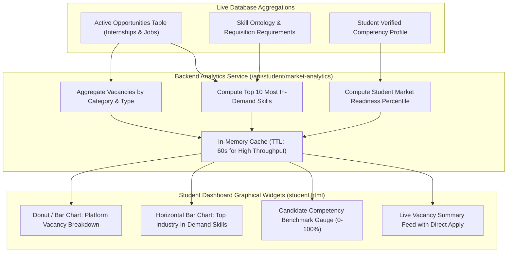

# Module Implementation Plan: Real-Time Graphical Analytics & Vacancy Summary
**PPT Innovation Feature #1:** *"Student portal section featuring real-time graphical analytics and summaries of current platform internships and job vacancies."*  
**Target Directory:** `a:\ProgrammingCodes\Projects\SIH 26\mainsihrepo`  
**Status:** Implementation Blueprint

---

## 1. Problem & Feature Scope

Currently, the student portal overview page (`student.html`) features numeric metrics (XP, Streaks, Applications count), but lacks the **real-time graphical analytics** promised in the SIH 2026 PPT. Students need intuitive visual charts that clearly convey:
1. **Live Platform Vacancies Breakdown**: Distribution of current openings across Internships, Full-Time Jobs, Micro-Gigs, and Hackathons.
2. **High-Demand Market Skills Index**: Dynamic frequency distribution of the technical competencies requested by corporate employers in live postings.
3. **Candidate Readiness vs. Industry Benchmark**: A visual gauge/radar comparing the student's verified skills against live market requirements.
4. **Sector Opportunity Growth Trends**: Real-time trend visualizers highlighting growing hiring sectors (AI/Data, Healthcare/Ayush Informatics, Full-Stack Engineering, Biotechnology).

---

## 2. Technical Architecture & Component Flow



---

## 3. API Specification

### Endpoint: `GET /api/student/market-analytics`
**Authentication:** Authenticated student (`authenticateToken`, role `student`).

#### Response Payload Structure:
```json
{
  "success": true,
  "timestamp": "2026-10-02T10:30:00Z",
  "summary": {
    "totalOpenings": 48,
    "internshipsCount": 26,
    "jobsCount": 14,
    "microGigsCount": 5,
    "hackathonsCount": 3,
    "activeHiringCompanies": 18
  },
  "vacancyDistribution": [
    { "category": "Internships", "count": 26, "color": "#10B981" },
    { "category": "Full-Time Jobs", "count": 14, "color": "#6366F1" },
    { "category": "Micro-Gigs & Bounties", "count": 5, "color": "#06B6D4" },
    { "category": "Hackathons & Challenges", "count": 3, "color": "#F59E0B" }
  ],
  "topInDemandSkills": [
    { "skill": "Python & Data Science", "demandCount": 32, "growth": "+18%" },
    { "skill": "Data Structures & Algorithms", "demandCount": 29, "growth": "+12%" },
    { "skill": "React.js & Modern Frontend", "demandCount": 24, "growth": "+15%" },
    { "skill": "Good Laboratory Practice (GLP)", "demandCount": 21, "growth": "+22%" },
    { "skill": "RESTful APIs & Microservices", "demandCount": 19, "growth": "+14%" }
  ],
  "candidateReadiness": {
    "overallPercentile": 78,
    "matchedSkillsCount": 6,
    "recommendedNextSkill": "Cloud Infrastructure & Docker",
    "tier": "Competitive Candidate"
  }
}
```

---

## 4. Frontend UI & Visual Component Design

### 1. Dedicated Analytics Grid on `student.html`
Place a dedicated **"Platform Pulse & Vacancy Analytics"** section right below the student greeting:

```html
<!-- REAL-TIME GRAPHICAL ANALYTICS SECTION -->
<section class="grid grid-cols-1 lg:grid-cols-3 gap-6 mb-8">
  
  <!-- Widget 1: Vacancy Distribution Chart -->
  <div class="p-6 rounded-2xl bg-white dark:bg-white/[0.03] border border-[#E7E4DC] dark:border-white/10 shadow-sm flex flex-col justify-between">
    <div class="flex items-center justify-between pb-3 border-b border-[#E7E4DC] dark:border-white/10">
      <div>
        <h3 class="text-sm font-bold text-[#1C1917] dark:text-white">Current Platform Vacancies</h3>
        <p class="text-[11px] text-[#6E6962] dark:text-gray-400">Live breakdown across verified enterprise postings</p>
      </div>
      <span class="w-2 h-2 rounded-full bg-emerald-500 animate-pulse"></span>
    </div>
    <div class="h-48 relative flex items-center justify-center my-2">
      <canvas id="vacancy-distribution-chart"></canvas>
    </div>
    <div id="vacancy-legend" class="grid grid-cols-2 gap-2 text-xs pt-3 border-t border-[#E7E4DC] dark:border-white/10"></div>
  </div>

  <!-- Widget 2: High-Demand Market Skills -->
  <div class="p-6 rounded-2xl bg-white dark:bg-white/[0.03] border border-[#E7E4DC] dark:border-white/10 shadow-sm flex flex-col justify-between">
    <div class="flex items-center justify-between pb-3 border-b border-[#E7E4DC] dark:border-white/10">
      <div>
        <h3 class="text-sm font-bold text-[#1C1917] dark:text-white">Top Skills In Demand</h3>
        <p class="text-[11px] text-[#6E6962] dark:text-gray-400">Most requested across active requisitions</p>
      </div>
      <span class="text-xs font-mono font-bold text-purple-600 dark:text-purple-400">Live Q4 Demand</span>
    </div>
    <div id="demand-skills-bars" class="space-y-3 my-3">
      <!-- Dynamically rendered horizontal animated progress bars -->
    </div>
    <p class="text-[10px] text-gray-400 text-center pt-2">Updated live from corporate partner postings</p>
  </div>

  <!-- Widget 3: Candidate Market Readiness Gauge -->
  <div class="p-6 rounded-2xl bg-white dark:bg-white/[0.03] border border-[#E7E4DC] dark:border-white/10 shadow-sm flex flex-col justify-between">
    <div class="flex items-center justify-between pb-3 border-b border-[#E7E4DC] dark:border-white/10">
      <div>
        <h3 class="text-sm font-bold text-[#1C1917] dark:text-white">Candidate Placement Readiness</h3>
        <p class="text-[11px] text-[#6E6962] dark:text-gray-400">Indexed against live requisitions & peer pool</p>
      </div>
      <span id="readiness-badge" class="px-2 py-0.5 rounded text-[10px] font-bold bg-emerald-500/10 text-emerald-500">Tier 1</span>
    </div>
    <div class="h-44 relative flex flex-col items-center justify-center my-2">
      <canvas id="candidate-readiness-gauge"></canvas>
      <div class="absolute inset-0 flex flex-col items-center justify-center pt-8">
        <span id="readiness-score-text" class="text-3xl font-extrabold text-[#1C1917] dark:text-white">78%</span>
        <span class="text-[11px] text-[#6E6962] dark:text-gray-400 font-medium">Market Fit</span>
      </div>
    </div>
    <div class="pt-3 border-t border-[#E7E4DC] dark:border-white/10 flex items-center justify-between">
      <span class="text-xs text-gray-500">Recommended Gap:</span>
      <span id="recommended-next-skill" class="text-xs font-bold text-blue-600 dark:text-blue-400">Cloud Infrastructure</span>
    </div>
  </div>

</section>
```

### 2. Zero-Dependency Canvas Chart Rendering
Implement clean, robust Canvas-based 2D rendering in `js/frontend/student-features.js` so it works offline and independently without relying on external CDN scripts.

---

## 5. Testing & Validation Checklist

- [ ] Call `GET /api/student/market-analytics` and verify structure with 4 vacancy types and top skills.
- [ ] Verify vacancy distribution canvas renders clean donut arcs with correct totals.
- [ ] Verify skills progress bars render with percentage widths and growth indicators.
- [ ] Verify readiness gauge renders semi-circular arc matching student's verified skills score.
- [ ] Verify dark/light theme switching updates chart colors dynamically.
