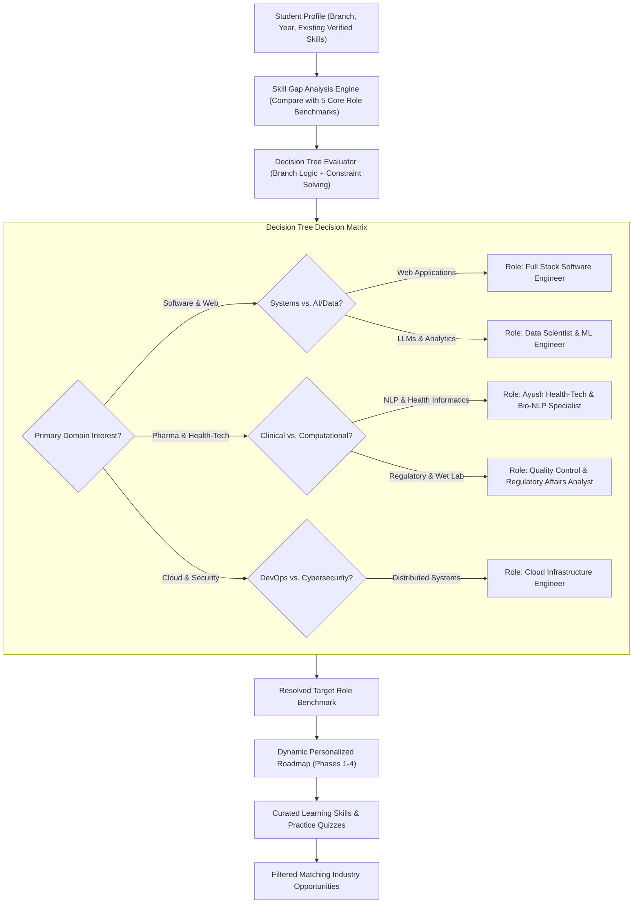

# Module Implementation Plan: Decision Tree & Personalized Roadmap Engine
**PPT Core Process Flow:**  
*`Student Profile ➔ Skill Gap Analysis ➔ Decision Tree ➔ Target Role ➔ Personalized Roadmap ➔ Learning Skills ➔ Industry Opportunity`*  
**Target Directory:** `a:\ProgrammingCodes\Projects\SIH 26\mainsihrepo`  
**Status:** Implementation Blueprint

---

## 1. Problem & Feature Scope

The SIH 2026 PPT explicitly specifies a sequential placement preparation workflow:
```
Student Profile ──► Skill Gap Analysis ──► Decision Tree ──► Target Role ──► Personalized Roadmap ──► Learning Skills ──► Industry Opportunity
```
While the codebase currently has a roadmap page (`src/students/student-roadmap.html`) with fixed predefined tracks, it lacks the interactive **Decision Tree Engine** that algorithmically analyzes the student's background, current gaps, career aspiration, and timeline to resolve their optimal **Target Role** and dynamically generate a **Personalized Milestone Roadmap**.

This module delivers:
1. **Interactive Decision Tree Wizard**: A guided, intelligent decision-tree assessment on `student-roadmap.html`.
2. **Algorithmic Target Role Classifier**: Evaluates academic branch, self-efficacy, technical inclinations, and gap severity across the 88-skill ontology to recommend the best-fit target role (e.g. *Full Stack Engineer*, *Ayush Health-Tech & Bio-NLP Specialist*, *Cloud & DevOps Engineer*, *Herbal Formulation Scientist*).
3. **Dynamic Roadmap Synthesizer**: Generates a tailored 4-phase milestone roadmap personalized to the student's gaps, complete with deliverables, XP bounties, and direct learning links.
4. **Direct Industry Opportunity Bridge**: Automatically attaches live matching internships and job vacancies to the student's roadmap upon role resolution.

---

## 2. Technical Architecture & Component Flow



---

## 3. Decision Tree API Specification

### Endpoint: `POST /api/roadmap/decision-tree`
**Authentication:** Authenticated student (`authenticateToken`, role `student`).

#### Request Payload:
```json
{
  "academicDepartment": "Ayush Health Informatics & Phytopharmacology",
  "careerAmbition": "Applied AI & Bioinformatics",
  "technicalComfortLevel": "Intermediate",
  "preferredPaceMonths": 6,
  "existingSkills": ["Python", "CAMAG HPTLC Densitometry"],
  "primaryGoal": "Industry Internship"
}
```

#### Response Payload:
```json
{
  "success": true,
  "decisionPath": [
    "Domain: Interdisciplinary Healthcare & Technology",
    "Orientation: Computational Informatics over Wet Lab",
    "Skill Baseline: Python Established",
    "Prescribed Specialty: Bio-NLP & Health Informatics"
  ],
  "targetRole": {
    "roleId": "ayush-health-nlp",
    "title": "Ayush Health-Tech & Bio-NLP Specialist",
    "benchmarkCompatibility": 64,
    "primarySkillGaps": ["Natural Language Processing", "Biomedical NER", "FastAPI Serving"],
    "marketDemandLevel": "Very High"
  },
  "personalizedRoadmap": {
    "title": "Accelerated Pathway to Health-Tech Specialist",
    "totalDuration": "6 Months",
    "estimatedXpAvailable": 1200,
    "phases": [
      {
        "phase": "Phase 1: Foundations",
        "timeline": "Month 1 - 2",
        "focus": "Clinical Vocabulary & Bio-Embeddings",
        "tasks": [
          { "id": "t-1", "title": "Implement BioBERT text tokenization pipeline", "xp": 100, "completed": false },
          { "id": "t-2", "title": "Build Ayurvedic Monograph text extractor", "xp": 120, "completed": false }
        ]
      },
      {
        "phase": "Phase 2: Core Engineering",
        "timeline": "Month 3 - 4",
        "focus": "REST APIs & Vector Retrieval",
        "tasks": [
          { "id": "t-3", "title": "Deploy Qdrant vector store with PubMed embeddings", "xp": 150, "completed": false }
        ]
      }
    ]
  },
  "matchingOpportunities": [
    { "id": "opp-tech-03", "title": "Ayush NLP & Knowledge Graph Fellow", "company": "Ministry of Ayush / AIIA", "fitScore": 78 }
  ]
}
```

---

## 4. Frontend UI Design (`src/students/student-roadmap.html`)

### 1. The Decision Tree Wizard Modal / Hero Drawer
Add a prominent banner at the top of the roadmap page:

```html
<!-- DECISION TREE HERO CTA -->
<div class="mb-8 p-6 rounded-3xl bg-gradient-to-r from-purple-900/40 via-indigo-900/30 to-blue-900/20 border border-purple-500/30 backdrop-blur-md shadow-lg flex flex-col sm:flex-row items-center justify-between gap-6">
  <div class="space-y-2">
    <div class="flex items-center gap-2">
      <span class="px-2 py-0.5 rounded-full bg-purple-500/20 text-purple-300 font-mono text-[10px] uppercase font-bold border border-purple-500/30">Process Flow: Step 2 &amp; 3</span>
      <span class="text-xs text-gray-400">• Placement Readiness Engine</span>
    </div>
    <h2 class="text-2xl font-black text-white">Find Your Optimal Target Role via Decision Tree</h2>
    <p class="text-xs text-gray-300 max-w-xl">
      Not sure which pathway to pursue? Our adaptive decision tree cross-references your current department, verified competencies, and industry demand to synthesize your custom career roadmap.
    </p>
  </div>
  <button onclick="openDecisionTreeModal()" class="shrink-0 px-6 py-3 rounded-2xl bg-gradient-to-r from-purple-600 to-indigo-600 hover:from-purple-500 hover:to-indigo-500 text-white font-bold text-xs shadow-md transition transform active:scale-95 flex items-center gap-2">
    <span class="material-symbols-outlined text-base">account_tree</span>
    <span>Launch Decision Tree</span>
  </button>
</div>
```

### 2. Multi-Step Interactive Decision Tree Dialog
- **Step 1: Discipline & Orientation** (Software / Health-Tech / Core Engineering / Biotechnology).
- **Step 2: Applied Focus** (Systems Engineering / Predictive Analytics / Regulatory / Full-Stack).
- **Step 3: Timeline & Bandwidth** (3 Months Intensive / 6 Months Comprehensive).
- **Instant Result Screen**: Displays the decision tree reasoning graph, outputs the Target Role card, and unlocks the personalized roadmap with 1-click apply to synchronized opportunities.

---

## 5. Testing & Validation Checklist

- [ ] Call `POST /api/roadmap/decision-tree` with student profile inputs and receive synthesized target role.
- [ ] Verify decision tree reasoning returns clear, explainable diagnostic paths.
- [ ] Verify that generated roadmap persists in student roadmap record (`student_roadmaps` table in Supabase).
- [ ] Complete tasks in generated roadmap and verify XP updates properly on student profile.
- [ ] Verify roadmap connects directly to matching opportunities from the database.
