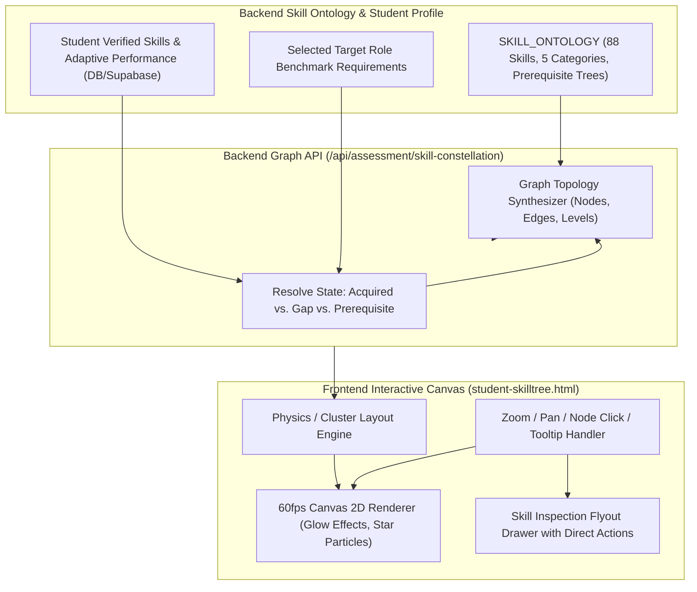

# Module Implementation Plan: Dynamic Skill Constellation Graph
**PPT Core Visual Feature:** *"a visual Skill Constellation graph that intuitively maps technical competencies beyond static syllabi"*  
**Target Directory:** `a:\ProgrammingCodes\Projects\SIH 26\mainsihrepo`  
**Status:** Implementation Blueprint

---

## 1. Problem & Feature Scope

Slide 2 of the SIH 2026 PPT highlights the **Visual Skill Constellation graph** as a flagship innovation for mapping competencies beyond static classroom syllabi.

Currently, `src/students/student-skilltree.html` renders a 2D canvas with only **6 static, hardcoded nodes** in `student-ui.js` (`Core Foundations`, `Domain Methodology`, `Applied Analytics`, etc.). It does not reflect the real competencies of the student, nor does it connect to the canonical 88-skill ontology or target industry roles.

This module delivers:
1. **Dynamic Constellation Topology Engine**: Generates a multi-cluster competency graph (20-30 connected nodes per domain cluster) based on the project's canonical `SKILL_ONTOLOGY`.
2. **Personalized Competency State Mapping**: Nodes visually indicate:
   - 🟢 **Acquired & Verified** (Highlighted in glowing emerald/purple with verified badge checkmark).
   - 🟡 **In Progress / Current Learning** (Golden ring with current progress percentage).
   - 🔴 **Target Role Gap** (Pulsing amber/crimson indicator highlighting required prerequisites).
   - ⚪ **Locked / Future Elective** (Subtle slate node connected by dependency edges).
3. **Interactive Exploration & Direct Action**:
   - Hover tooltips showing skill definition, industry demand frequency, and related jobs.
   - Click node to open a flyout drawer with options: *"Take Practice Quiz in Quiz Arena"*, *"Add to Career Roadmap"*, or *"View Requisitions Requesting this Skill"*.
4. **Hardware-Accelerated Canvas Rendering**: Smooth 60fps canvas animation with zooming, panning, particle links, and dark/light mode adaptability.

---

## 2. Technical Architecture & Component Flow



---

## 3. API Specification

### Endpoint: `GET /api/assessment/skill-constellation`
**Authentication:** Authenticated student (`authenticateToken`, role `student`).

#### Response Payload Structure:
```json
{
  "success": true,
  "clusterName": "Full Stack & Cloud Architecture",
  "totalNodes": 18,
  "acquiredCount": 8,
  "gapsCount": 4,
  "nodes": [
    {
      "id": "skill-dsa",
      "label": "Data Structures & Algorithms",
      "category": "Foundations",
      "tier": 1,
      "status": "acquired",
      "xpAwarded": 150,
      "industryDemand": "94%",
      "x": 120,
      "y": 240
    },
    {
      "id": "skill-fastapi",
      "label": "REST APIs & Backend Architecture",
      "category": "Backend Engineering",
      "tier": 2,
      "status": "in_progress",
      "prerequisites": ["skill-dsa"],
      "xpAwarded": 0,
      "industryDemand": "88%",
      "x": 320,
      "y": 180
    },
    {
      "id": "skill-docker",
      "label": "Docker & Containerization",
      "category": "DevOps & Cloud",
      "tier": 3,
      "status": "target_gap",
      "prerequisites": ["skill-fastapi"],
      "industryDemand": "82%",
      "x": 520,
      "y": 180
    }
  ],
  "edges": [
    { "from": "skill-dsa", "to": "skill-fastapi", "type": "prerequisite" },
    { "from": "skill-fastapi", "to": "skill-docker", "type": "prerequisite" }
  ]
}
```

---

## 4. Frontend Canvas Upgrades (`student-skilltree.html`)

### 1. Canvas Viewport with Controls & Filter Tabs
```html
<!-- CONSTELLATION CLUSTER CONTROLS -->
<div class="flex items-center justify-between pb-4">
  <div class="flex items-center gap-2">
    <button onclick="setConstellationCluster('tech')" class="px-3 py-1.5 rounded-xl text-xs font-bold bg-[#0F172A] text-white dark:bg-white/10 dark:text-white">Software &amp; Cloud</button>
    <button onclick="setConstellationCluster('ai')" class="px-3 py-1.5 rounded-xl text-xs font-semibold text-gray-400 hover:text-white">AI &amp; Data Science</button>
    <button onclick="setConstellationCluster('ayush')" class="px-3 py-1.5 rounded-xl text-xs font-semibold text-gray-400 hover:text-white">Ayush Informatics</button>
  </div>
  <div class="flex items-center gap-2">
    <button onclick="zoomConstellation(1.2)" class="p-2 rounded-lg border border-gray-800 text-gray-300 hover:bg-white/5"><span class="material-symbols-outlined text-sm">zoom_in</span></button>
    <button onclick="zoomConstellation(0.8)" class="p-2 rounded-lg border border-gray-800 text-gray-300 hover:bg-white/5"><span class="material-symbols-outlined text-sm">zoom_out</span></button>
    <button onclick="resetConstellationView()" class="p-2 rounded-lg border border-gray-800 text-gray-300 hover:bg-white/5"><span class="material-symbols-outlined text-sm">restart_alt</span></button>
  </div>
</div>
```

### 2. Interactive Node Drawer Flyout
Clicking any node slides out a modal with:
- **Skill Proficiency Card**: Level (Beginner / Competent / Mastered).
- **Prerequisites Satisfied Indicator**: Checkmark tree showing fulfilled prerequisites.
- **Direct Actions**:
  - `[Test Competency in Quiz Arena]`: Launches a 3-question adaptive quiz for this specific skill.
  - `[Add Milestone to Roadmap]`: Direct insert into student's career roadmap docket.
  - `[View Matching Jobs]`: Jumps to `student-jobs.html?skill=Docker`.

---

## 5. Testing & Validation Checklist

- [ ] Query `GET /api/assessment/skill-constellation` and verify node-edge graph payload.
- [ ] Verify canvas renders multi-node clusters dynamically instead of 6 static points.
- [ ] Verify acquired skills render with green/purple glow and checkmarks.
- [ ] Verify target gaps render with pulsing warning indicators.
- [ ] Click a node and verify skill inspection flyout opens with accurate prerequisites and actions.
- [ ] Verify canvas zoom and pan respond smoothly without jitter or visual artifacts.
