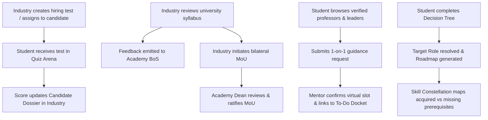

# JOBLEX-OpportunityFlow: Complete Implementation Plans Index
**Smart India Hackathon 2026 | Problem Statement ID: 26044**  
**Team: FOXTROT (Team ID: 168485)**  
**Target Directory:** `tmp/plan/`

---

## Index of Implementation Plans

This folder contains the complete, detailed engineering blueprints to bridge every gap between the **SIH 2026 PPT (`JOBLEX-OpportunityFlow`)** and the repository codebase.

| # | Plan File | Focus Area & PPT Reference | Status |
| :-: | :--- | :--- | :-: |
| 00 | [00_MASTER_SYNC_ARCHITECTURE_PLAN.md](file:///a:/ProgrammingCodes/Projects/SIH%2026/mainsihrepo/tmp/plan/00_MASTER_SYNC_ARCHITECTURE_PLAN.md) | **Master Synchronization Architecture**: Cross-portal sync contracts (Student $\leftrightarrow$ Academy $\leftrightarrow$ Industry), unified RBAC, database entities, and phased rollout matrix. | Ready |
| 01 | [01_COMPANY_HIRING_EXAM_MODULE_PLAN.md](file:///a:/ProgrammingCodes/Projects/SIH%2026/mainsihrepo/tmp/plan/01_COMPANY_HIRING_EXAM_MODULE_PLAN.md) | **PPT Uniqueness #1**: Company hiring test engine, exam builder, candidate assignment, student Quiz Arena integration, and automated grading. | Ready |
| 02 | [02_SYLLABUS_REVIEW_AND_MOU_MODULE_PLAN.md](file:///a:/ProgrammingCodes/Projects/SIH%2026/mainsihrepo/tmp/plan/02_SYLLABUS_REVIEW_AND_MOU_MODULE_PLAN.md) | **PPT Uniqueness #2**: Multi-company university syllabus review, BoS feedback loops, and bilateral MoU initiation and ratification workflow. | Ready |
| 03 | [03_ONE_ON_ONE_GUIDANCE_MODULE_PLAN.md](file:///a:/ProgrammingCodes/Projects/SIH%2026/mainsihrepo/tmp/plan/03_ONE_ON_ONE_GUIDANCE_MODULE_PLAN.md) | **PPT Innovation #2**: 1-on-1 guidance booking connecting students with verified academic professors and corporate industry leaders. | Ready |
| 04 | [04_REALTIME_GRAPHICAL_ANALYTICS_PLAN.md](file:///a:/ProgrammingCodes/Projects/SIH%2026/mainsihrepo/tmp/plan/04_REALTIME_GRAPHICAL_ANALYTICS_PLAN.md) | **PPT Innovation #1**: Real-time graphical analytics on the Student Portal (live vacancy breakdown donut, in-demand skills bar chart, readiness gauge). | Ready |
| 05 | [05_DECISION_TREE_AND_ROADMAP_PLAN.md](file:///a:/ProgrammingCodes/Projects/SIH%2026/mainsihrepo/tmp/plan/05_DECISION_TREE_AND_ROADMAP_PLAN.md) | **PPT Process Flow**: Interactive Decision Tree wizard resolving student target roles and synthesizing personalized milestone roadmaps. | Ready |
| 06 | [06_DYNAMIC_SKILL_CONSTELLATION_GRAPH_PLAN.md](file:///a:/ProgrammingCodes/Projects/SIH%2026/mainsihrepo/tmp/plan/06_DYNAMIC_SKILL_CONSTELLATION_GRAPH_PLAN.md) | **PPT Visual Competency Graph**: Dynamic multi-node constellation graph connected to the 88-skill ontology, showing acquired vs. gap states. | Ready |
| 07 | [07_DATA_RESILIENCE_AND_API_STABILITY_PLAN.md](file:///a:/ProgrammingCodes/Projects/SIH%2026/mainsihrepo/tmp/plan/07_DATA_RESILIENCE_AND_API_STABILITY_PLAN.md) | **API Resilience & Bug Fixes**: Graceful database failover in `opportunities.routes.js`, ensuring all E2E verification suites pass 100%. | Ready |

---

## Synchronization Matrix Summary

